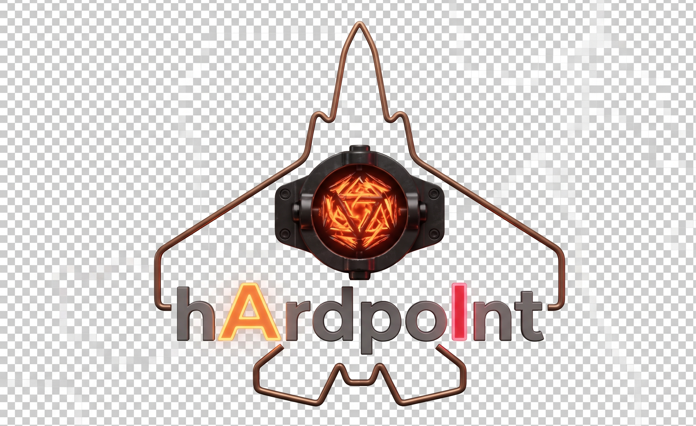

# Hardpoint

Local dashboard for **local AI / tool servers** and **NVIDIA GPU** status on this machine. You scan localhost or add presets (Ollama, Chatterbox, ComfyUI, …) — nothing is forced onto the dashboard. Start/Stop use each card’s actions; a loopback HTTP API supports embeds.

This repo follows the shared conventions in [gerp93/KVG_Standards](https://github.com/gerp93/KVG_Standards) (theming, release/CI, update-check, licensing, logo/branding) — see that repo for the rules this one is expected to keep up with.

## Development

```
npm install
npm run generate-icons   # after changing assets/logo.png
npm run dev
```

The renderer dev server runs on port **5174** (Vite). The main process serves `http://127.0.0.1:3921/api/status` for local embeds (RolePlaymate / KVGenius). `GET /` redirects to the Vite UI in development and serves the packaged renderer when installed.

## Build

```
npm run build
npm run package
```

## Releases

Every push to `main` triggers [Auto Release](.github/workflows/auto-release.yml), which bumps a semantic version tag and calls [KVG_Standards' `release-electron.yml`](https://github.com/gerp93/KVG_Standards/blob/main/.github/workflows/release-electron.yml). [Cut Release](.github/workflows/cut-release.yml) is available for a manually chosen version. To force a release with no code change, add a dated entry to [`VERSION_BUMP.md`](VERSION_BUMP.md).
