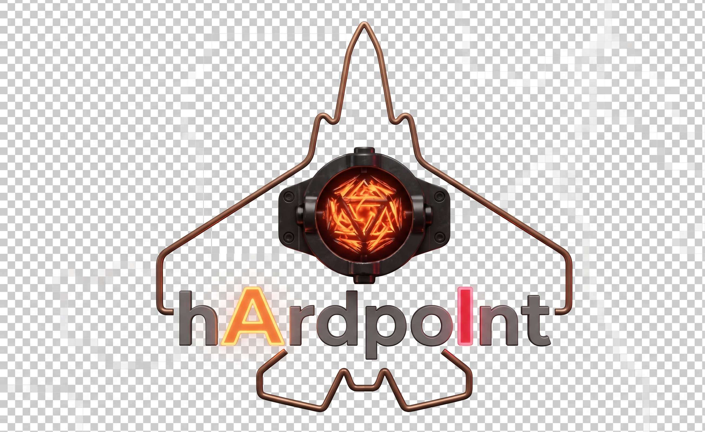

# Hardpoint

Local dashboard for **local AI / tool servers** and **NVIDIA GPU** status on this machine. You scan localhost or add presets (Ollama, Chatterbox, ComfyUI, Wreckfest 2 server, …) — nothing is forced onto the dashboard. A mount's status can come from an HTTP request, a TCP port, or a process running from its launch folder (for servers with no HTTP endpoint). Start/Stop use each card’s actions; a loopback HTTP API supports embeds.

This repo follows the shared conventions in [gerp93/KVG_Standards](https://github.com/gerp93/KVG_Standards) (theming, release/CI, update-check, licensing, logo/branding) — see that repo for the rules this one is expected to keep up with.

## Assistant

The floating **Assistant** button (desktop window only) opens a chat where you say which server you want to run. It researches the install, works out the start command, port, status check and stop method, and — after you approve — saves the mount so you only click Start next time.

- Runs on the Claude binary bundled with Hardpoint; use **Sign in** once (opens your browser, Hardpoint never sees your password).
- **What it can do:** read files on this PC (never credentials, keys or browser data), search the web, and create, edit, delete, start and stop Hardpoint mounts.
- **What it can't do:** write, edit or delete any file, run its own commands, or install software. It isn't given those tools at all. When something needs doing, it tells you the exact steps.
- **Approvals:** saving a mount shows you what will run (Start/Stop commands, status check, Open URL) and asks once; after you approve, it can start/stop that mount without asking again. Deleting a mount, or fetching a page outside well-known doc hosts (GitHub, Hugging Face, PyPI, npm, Read the Docs), also asks.
- The only command that ever runs is a mount's Start/Stop command. Commands that delete files, change system settings, ask for admin rights, push to git, or download-and-run code are refused when it saves a mount.

## Development

```
npm install
npm run generate-icons   # after changing assets/logo.png
npm run dev
```

The renderer dev server runs on port **5174** (Vite). The main process serves `http://127.0.0.1:3921/api/status` for local embeds (RolePlaymate / KVGenius). `GET /` redirects to the Vite UI in development and serves the packaged renderer when installed.

## Build

```
npm run build
npm run package
```

## Releases

Every push to `main` triggers [Auto Release](.github/workflows/auto-release.yml), which bumps a semantic version tag and calls [KVG_Standards' `release-electron.yml`](https://github.com/gerp93/KVG_Standards/blob/main/.github/workflows/release-electron.yml). [Cut Release](.github/workflows/cut-release.yml) is available for a manually chosen version. To force a release with no code change, add a dated entry to [`VERSION_BUMP.md`](VERSION_BUMP.md).
